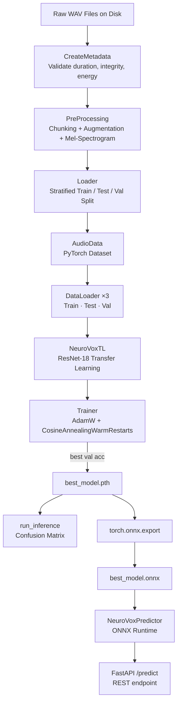

# System Overview

## Motivation

Parkinson's Disease (PD) causes neurological changes that progressively impair motor control, including the fine muscle movements involved in speech. Vocal biomarkers — reduced loudness, monotone pitch, breathiness, and tremor — are among the earliest observable symptoms, often appearing before motor symptoms become clinically apparent.

NeuroVox automates voice-based PD screening by learning to distinguish Healthy Control (`HC`) from Parkinson's Disease (`PD`) speech patterns directly from raw audio waveforms, with no need for handcrafted clinical features.

---

## End-to-End Pipeline



---

## Component Map

### Data Layer

| Module                        | Class            | Responsibility                                                   |
| ----------------------------- | ---------------- | ---------------------------------------------------------------- |
| `data/metadata.py`            | `CreateMetadata` | Scan directories, validate audio files, build metadata DataFrame |
| `preprocessing/processing.py` | `PreProcessing`  | Chunk audio, augment, compute Mel-Spectrograms, filter silence   |
| `data/custom_data.py`         | `AudioData`      | PyTorch `Dataset`: tensor conversion + label encoding            |
| `data/data_loader.py`         | `Loader`         | Stratified 70/20/10 split, create `DataLoader` instances         |

### Model Layer

| Module                   | Class         | Description                                                                       |
| ------------------------ | ------------- | --------------------------------------------------------------------------------- |
| `models/neurovox_cnn.py` | `NeuroVoxCNN` | Custom 3-block CNN (Conv → BN → ReLU → MaxPool)                                   |
| `models/neurovox_rn.py`  | `NeuroVoxRN`  | Custom ResNet with residual skip connections                                      |
| `models/neurovox_tl.py`  | `NeuroVoxTL`  | **Primary model** — ResNet-18 pretrained on ImageNet, adapted for 1-channel input |

### Training & Evaluation Layer

| Module              | Class     | Responsibility                                                   |
| ------------------- | --------- | ---------------------------------------------------------------- |
| `training/train.py` | `Trainer` | Training loop, checkpointing, history plotting, confusion matrix |

### Inference & Deployment Layer

| Module                   | Class               | Responsibility                                    |
| ------------------------ | ------------------- | ------------------------------------------------- |
| `inference/predictor.py` | `NeuroVoxPredictor` | Load ONNX model, preprocess WAV, run inference    |
| `api/endpoint.py`        | FastAPI app         | `POST /predict` endpoint with async file handling |
| `pipeline/pipeline.py`   | `PipeLine`          | Orchestrates all stages end-to-end                |

---

## Dataset

- **Expected layout:**
  ```
  data/
  ├── PD/   ← Parkinson's Disease recordings
  └── HC/   ← Healthy Control recordings
  ```
- **Audio format:** `.wav` files, any sample rate (resampled to 22,050 Hz internally)
- **Validation criteria:** minimum 1 second duration, non-silent, finite signal values
- **Dataset summary (example run):**
  - Total valid files: 1,274
  - PD samples: 663
  - HC samples: 611
  - Failed/rejected files: 404

---

## Key Design Decisions

### Why Mel-Spectrograms?

Mel-Spectrograms convert 1D audio waveforms into 2D time-frequency images that encode perceptually relevant frequency content. This lets standard 2D CNN architectures — originally designed for images — process audio with minimal modification.

### Why Transfer Learning?

ResNet-18 pretrained on ImageNet already learns low-level edge and texture detectors that generalize well to spectrogram patterns. Fine-tuning from this starting point converges faster and generalizes better than training from scratch on a small medical audio dataset.

### Why ONNX Export?

ONNX decouples inference from the PyTorch training runtime. The exported model runs on `onnxruntime`, which is lighter, faster, and deployable without carrying PyTorch as a dependency — important for clinical or edge deployments.

### Why Chunking with Overlap?

Medical audio recordings vary in length. Chunking normalizes input length (6 seconds per chunk, 10% overlap) and dramatically expands the effective dataset size — a single long recording contributes multiple training samples. Overlap reduces boundary artifacts at chunk edges.
